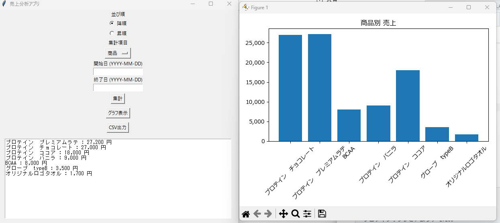

# sales-analysis-app

# 📊 Sales Analysis App

Python + Tkinter で作成した売上分析アプリです。

## 🚀 機能

- CSVファイル読み込み
- 商品 / 日付 / 支払方法 / 担当者 / 店舗ごとの集計
- 期間指定フィルター
- 売上グラフ表示（棒グラフ）
- 並び替え（昇順 / 降順）
- 集計結果CSV出力

---

## 🛠 使用技術

- Python 3
- Tkinter
- Matplotlib

---

## 📂 ファイル構成

sales_ap/
　├ main.py # 起動ファイル　
　├ logic.py # 売上計算ロジック　
　├ gui.py # 画面UI　
　└ sales_today.cs　

---

## ▶ 実行方法
1.sales_today.csv を用意
2.ターミナルで以下を実行
py main.py

---

## 📷 実行画面

---

学習目的で作成しました。 学習日数12日

 ##🧠 工夫した点

 ロジックとGUIを分離した設計にしています。
責務分離を意識して構築しました。

---

